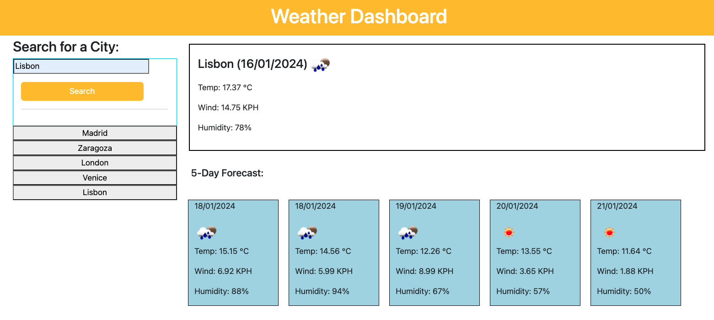

# Weather-Dashboard-Andrea-Melisa
Use the 5 Day Weather Forecast to retrieve weather data for cities.

## Description

This project is the challenge number eight from the bootcamp. In this case as a developer I need to create a weather daschboard API using another application's API. In other words, build a weather dashboard that will run in the browser and feature dynamically updated HTML and CSS.

Use the [5 Day Weather Forecast](https://openweathermap.org/forecast5) to retrieve weather data for cities. The link should take you to a guide on how to use the 5 Day Forecast API.

Also I will need to use `localStorage` to store any persistent data.

## Acceptance Criteria

- Create a weather dashboard with form inputs.
  - When a user searches for a city they are presented with current and future conditions for that city and that city is added to the search history
  - When a user views the current weather conditions for that city they are presented with:
    - The city name
    - The date
    - An icon representation of weather conditions
    - The temperature
    - The humidity
    - The wind speed
  - When a user view future weather conditions for that city they are presented with a 5-day forecast that displays:
    - The date
    - An icon representation of weather conditions
    - The temperature
    - The humidity
  - When a user click on a city in the search history they are again presented with current and future conditions for that city

## Table of Contents
- [Installation](#installation)
- [Usage](#usage)
- [Credits](#credits)
- [License](#license)

## Installation
N/A

## Usage
To use the application here you have the link to the deployed webpage: https://andrea-melisa.github.io/Weather-Dashboard-Andrea-Melisa/

Write a task in the middle section and click on the button with the disk.

If you refresh the page, your tasks should remain.

Here you have a screenshot from the web page:

## Credits

Thanks to the instructor Laura Cole and to the TA Martin William from EDX and to the tutor Juan Delgado.
And a big thank you to Marcos Z. as allways.

Sources:

https://api.jquery.com/

https://Day.js

https://developer.mozilla.org/en-US/docs/Web/API/Window/localStorage

https://openweathermap.org/forecast5

## License
Please refer to the LICENSE in the repo.

## Badges
*HTML 44.7%

*JavaScript 55.3%

